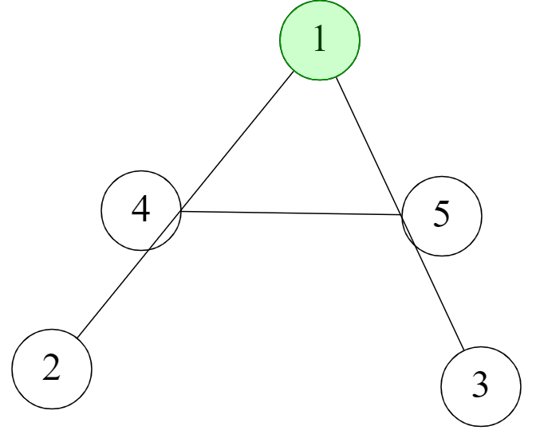

  

<h3 align="center">AlgoGraph</h3>

AlgoGraph is a tool to draw graphs and  visualizing different graph's algorithms.
 
<a href="https://ahmedhem.github.io/AlgoGraph/">View Demo</a>
·
<a href="https://github.com/ahmedhem/AlgoGraph/issues">Report Bug</a>
·
<a href="https://github.com/ahmedhem/AlgoGraph/issues">Request Feature</a>

---

## Contributors

### Ahmed Magdy
[![LinkedIn][linkedin-shield]][linkedin-url-m]

----

### Ahmed Eid
[![LinkedIn][linkedin-shield]][linkedin-url-e]

----

[comment]: <> (refrence links)
[linkedin-shield]: https://img.shields.io/badge/-LinkedIn-black.svg?style=for-the-badge&logo=linkedin&colorB=555
[linkedin-url-e]: https://linkedin.com/in/ahmedeid12
[linkedin-url-m]: https://linkedin.com/in/eng-ahmedmagdy

<!-- TABLE OF CONTENTS -->

  
<h2 style="display: inline-block">Table of Contents</h2>

  <ol>
    <li>
      <a href="#about-the-project">About The Project</a>
      <ul>
        <li><a href="#built-with">Built With</a></li>
        <li><a href="#features">Features</a></li>
      </ul>
    </li>
    
  </ol>

----

<!-- ABOUT THE PROJECT -->
## About The Project

- here will be an img or GIF of the project (TODO)

---

### Built With

* Html
* Css
* Javascript

---

### Features

### need to be updated (TODO)

 - It contains full dynamic area which supports : 
   - adding and deleting nodes.
   - adding directed and indirected edges between nodes, also putting weights on the edges.
   - saving your drawed graph.
   - drag and drop the nodes.
 - Drawing the graph inside the area using adjacency matrix.
 - Running and visualzing different Algorithms like (DrawAsTree, finding minimum distance between two nodes,etc).

---