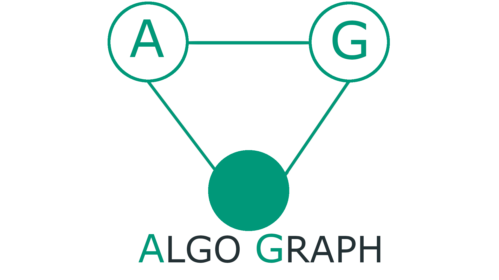

  

<h3 align="center">AlgoGraph</h3>

AlgoGraph is a tool to draw graphs and visualizing different graph's algorithms.
 
<a href="https://ahmedhem.github.io/AlgoGraph/">View Demo</a>
·
<a href="https://github.com/ahmedhem/AlgoGraph/issues">Report Bug</a>
·
<a href="https://github.com/ahmedhem/AlgoGraph/issues">Request Feature</a>

---

[comment]: <> (refrence links)
[linkedin-shield]: https://img.shields.io/badge/-LinkedIn-black.svg?style=for-the-badge&logo=linkedin&colorB=066
[linkedin-url-e]: https://linkedin.com/in/ahmedeid12
[linkedin-url-m]: https://linkedin.com/in/eng-ahmedmagdy

### [Live site](https://ahmedhem.github.io/AlgoGraph/)

---
<!-- TABLE OF CONTENTS -->

  
Table of Contents

  <ol>
    <li>
      <a href="#about-the-project">About The Project</a>
        <li><a href="#features">Features</a></li>
        <li><a href="#Contributors">Contributors</a></li>
    </li>
  </ol>

----

<!-- ABOUT THE PROJECT -->
### About The Project

The project mainly consist of two componenets : 
- **A Graph Editor**: 
  - To draw nodes and edges of a graph either by drawing on a canvas or by entering the graph info in a matrix or a text format.
   

- **Algorithm visualizer**:  
  - Which simply visualize how multiple graph algorithms work and allow interction with them.
---
### **_Note_**:
**_This project was built from scratch without the usage of any external libraries as a 
challenge and opportunity to enhance our skills and to gain some new experience._**

---

### Features
1. Graph Editor
    

Supports drawing nodes and connecting them with edges.

Supports all types of graphs (Weighted, unweighted, directed, and undirected)

- 

Supports the following operations on nodes.

Moving and Deletion

- 

Change size and color

- 

Support Saving the graph as a text file, or an image.

- 

Entering the graph info in a matrix or a text format.

- 

Support reorganizing the graph in the shape of a tree.

- 

Support clearing everything on the canvas

- 

2. Algorithm visualizer
    - ...... (TODO)
    
---
### Contributors

#### Ahmed Magdy
[![LinkedIn][linkedin-shield]][linkedin-url-m]
----

#### Ahmed Eid
[![LinkedIn][linkedin-shield]][linkedin-url-e]

----
